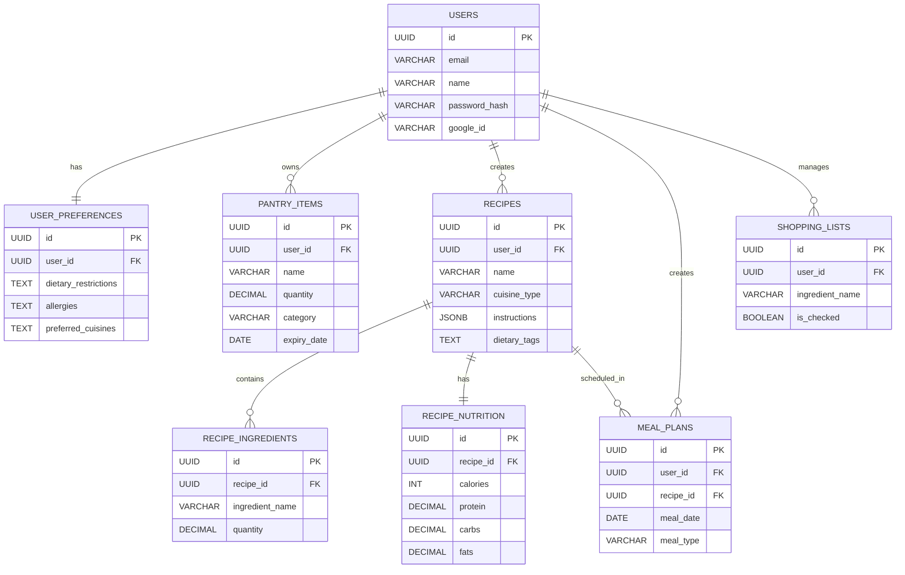

# 🍳 Smart Meal Planner

An AI-powered meal planning and pantry management platform that helps users generate recipes, organize ingredients, plan meals, and manage grocery shopping efficiently.

## 🚀 Features

### 🤖 AI Recipe Generation
- Generate recipes using Gemini AI
- Customize recipes based on ingredients
- Dietary restriction support
- Cuisine preference selection
- Adjustable serving sizes
- Cooking time preferences

### 🥫 Pantry Management
- Add and manage pantry items
- Track ingredient quantities
- Monitor expiring ingredients
- Pantry-based recipe suggestions

### 📅 Meal Planning
- Weekly meal planning
- Breakfast, lunch, and dinner scheduling
- Upcoming meals dashboard
- Meal calendar view

### 🛒 Smart Shopping List
- Create shopping lists 
- Categorized shopping items
- Mark items as purchased
- Move purchased items directly to pantry

### 👤 User Management
- JWT Authentication
- User Profiles
- Dietary Preferences
- Password Management

---

## 🛠️ Tech Stack

### Frontend
- React.js
- Vite
- Tailwind CSS
- Axios
- React Router
- React Hot Toast

### Backend
- Node.js
- Express.js
- PostgreSQL
- JWT + Google OAuth Authentication

### AI Integration
- Google Gemini API

### Deployment
- Vercel (Frontend)
- Railway (Backend)
- Neon PostgreSQL (Database)

---

# 🏗️ System Architecture

```text
                    User
                     |
                     |
              React Frontend
              (Vercel)
                     |
                     |
              Express Backend
              (Railway)
                     |
        ---------------------------
        |                         |
 PostgreSQL Database        Gemini AI API
     (Neon)              Recipe Generation
```

---

# 🗄️ Database Schema


---

User
 │
 │ Select Ingredients
 ▼
React Frontend
 │
 │ POST /generate-recipe
 ▼
Express Backend
 │
 │ Prompt Engineering
 ▼
Gemini API
 │
 │ JSON Recipe
 ▼
Backend Validation
 │
 │ Save Recipe
 ▼
PostgreSQL
 │
 ▼
Frontend Displays Recipe

## 📂 Project Structure

```text
Smart-Meal-Planner
│
├── backend
│   ├── config
│   ├── controllers
│   ├── middleware
│   ├── models
│   ├── routes
│   ├── utils
│   └── server.js
│
└── frontend
    └── AIrecipe
        ├── public
        ├── src
        └── vite.config.js
```

---

## ⚙️ Environment Variables

### Backend (.env)

```env
PORT=8000
DATABASE_URL=your_database_url
JWT_SECRET=your_jwt_secret
GEMINI_API_KEY=your_gemini_api_key
NODE_ENV=development
```

### Frontend (.env)

```env
VITE_API_URL=http://localhost:8000/api
```

---

## 🔧 Local Setup

### Clone Repository

```bash
git clone https://github.com/YOUR_USERNAME/Smart-Meal-Planner.git
cd Smart-Meal-Planner
```

### Backend Setup

```bash
cd backend
npm install
npm start
```

### Frontend Setup

```bash
cd frontend/AIrecipe
npm install
npm run dev
```

---

## 🌐 Live Demo

Frontend: [smart-meal-planner-two.vercel.app](https://smart-meal-planner-two.vercel.app/)

Backend API: https://smart-meal-planner-production-25be.up.railway.app/

---

## 🎯 Real-World Use Cases

- **Homemakers** – Simplifies daily meal planning, pantry management, and grocery shopping.
- **Busy Professionals** – Quickly generates recipes from available ingredients and helps plan meals for the week.
- **Students Living Away From Home** – Suggests meals using limited ingredients and reduces food expenses.
- **Fitness Enthusiasts** – Supports dietary preferences and customized meal planning.
- **Small Cafes & Tiffin Services** – Assists in meal scheduling and ingredient procurement planning.
- **Food Waste Reduction** – Prioritizes recipes using available and expiring ingredients to minimize waste.

---

## 🔮 Future Improvements

- Nutrition analytics dashboard
- Email reminders for expiring pantry items
- Grocery price comparison
- Meal plan sharing and collaboration

---

## 👨‍💻 Author

**Arnav Jain**


